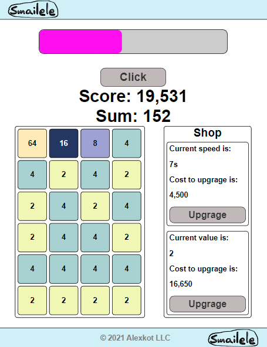

# Clicker
Just a funny, simple clicker.
____________________________
Each "time-delta" (current speed) a cell is spawning on a field and your score (aka "money") increases.
____________________________
Score increase depends of the sum of all cells on field.
____________________________
Clicker has a shop.

Shop include 2 functions:
- decrease a speed;
- increase a value of spawns cell.
____________________________
Results of playing save in a your cockies.
If your cockies disenabled, you will start new game every reload of the page.
____________________________
Refactoring of common-js version.
____________________________
Game Experience:

    

